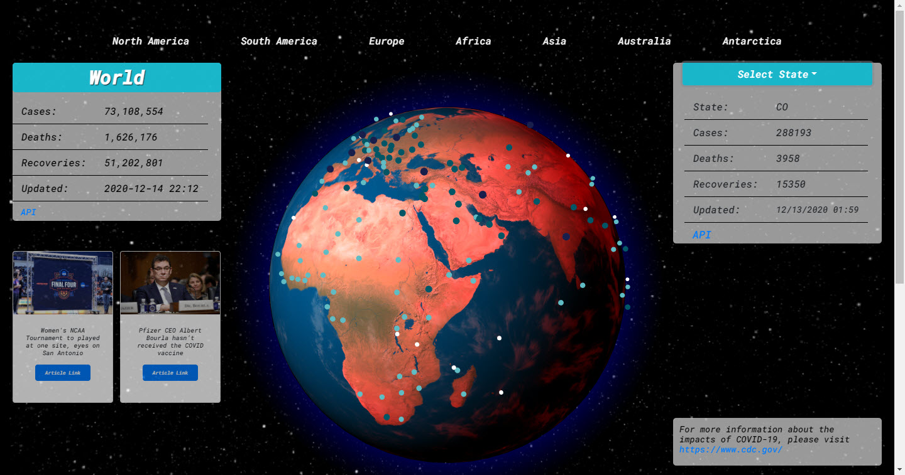

# My Pandemic Tracker
## Table of Contents

- **[Description](#Description)**
- **[Installation Requirements](#Installation-Requirements)**
- **[License](#License)**
- **[Questions](#Questions)**
# Description
Users are able to select a country on a globe and the COVID19 statistics are displayed in a box in the top left corner. The data is generated through an API and is frequently updated. The data provided shows how many COVID19 cases have been reported, recoveries, and deaths. With React hooks, the data gets updated upon selecting a new country on the form. In the top right corner is data from a second API that uses US Data by State. Users can select a state from a drop-down menu to view COVID19 statistics for that state. Links to both APIs are included in the application. An additional API generates news articles about COVID19 and is also updated daily. 

## Deployed Site @ https://covid19-pandemic-tracker.herokuapp.com/
---

# Technology Used
* COVID-19 API from [Rapidapi](https://rapidapi.com/collection/coronavirus-covid-19)
* [GNews API](https://gnews.io/)
* [MERN Stack](https://www.mongodb.com/mern-stack)
   * [MongoDB](https://www.mongodb.com/)
   * [Express.js](https://expressjs.com/)
   * [React.js](https://reactjs.org/)
   * [Node.js](https://nodejs.org/en/)
* [React Globe](https://react-globe.netlify.app/)
* [Axios](https://www.npmjs.com/package/axios)
* [Bootstrap](https://getbootstrap.com/)

# Installation Requirements 

1. Clone my portfolio in the command line by entering: git clone https://github.com/jaredseefried/covid19-pandemic-tracker.git 

2. Install required libraries from entering in the command line: npm install

3. Start the application by entering in the command line: npm start

# License

MIT

# Have Questions?

## [Github Profile: github.com/sallamy2580](https://github.com/sallamy2580 "Title")

Please email me at polarisfar7@gmail.com if you have additional questions.
